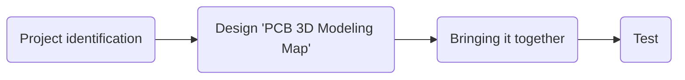

# hirob-em-embedded

# Welcome to hirob-em-embedded!

  Hello there!
# Our goals

 **To bring the project to a good end with the harmony within the team and to learn **

# Step By Step
- >Coded connection of circuit components with the microprocessor used for PCB board (motor driver, motor, encoder)
- >Determination of Hirob movement mechanics (programming forward, backward, right, left movements)
Programming the motor encoder counter according to the desired movement
- >Testing the compatibility of circuit components with the power supply and giving feedback to other teams

