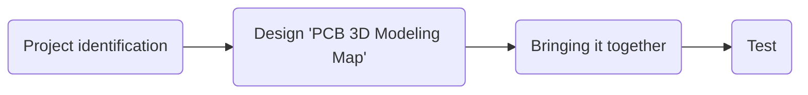

# hirob-em-embedded

# Welcome to hirob-em-embedded!

  Hello there!
# Our goals

 **To bring the project to a good end with the harmony within the team and to learn **

# Step By Step
- >PCB kartı için kullanılan mikroişlemci ile devre komponentlerinin kodsal bağlantısı (motor sürücü, motor, encoder)
- >Hirob hareket mekaniğinin belirlenmesi (ileri, geri, sağ, sol hareketlerinin programlanması)
motor encoder sayacının istenen harekete göre programlanması
- >Devre komponentlerinin güç kaynağı ile uyumunun test edilmesi ve diğer takımlara geri bildirim verilmesi

